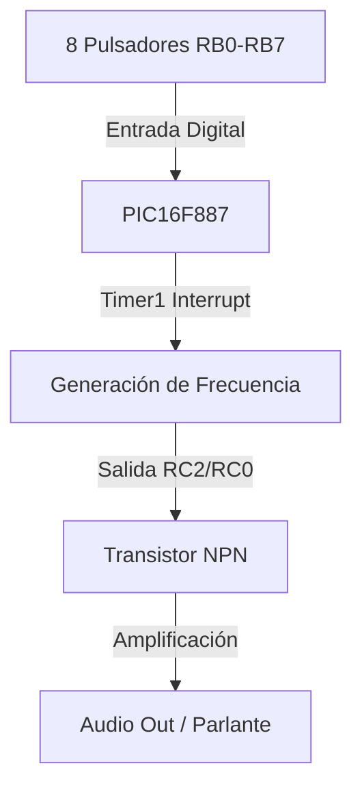

# Piano Electrónico con PIC16F887

## Proyecto de Sistemas Embebedos

## Badges

## Descripción General

Este proyecto consiste en el diseño e implementación de un **piano electrónico de 8 notas (una octava)** utilizando el microcontrolador PIC16F887. El sistema permite al usuario interactuar mediante un teclado de 8 pulsadores, generando frecuencias precisas para las notas musicales desde **Do4 (C4)** hasta **Do5 (C5)**.

El sistema destaca por el uso de:

  * **Timer1:** Para la generación de ondas cuadradas precisas mediante interrupciones.
  * **Control de Potencia:** Uso de un transistor NPN para manejar la carga del parlante.
  * **Manejo de I/O:** Configuración de entradas digitales con resistencias pull-down/pull-up.

-----

## Arquitectura del Sistema



-----

## Especificaciones de las Notas

| Nota | Frecuencia (Hz) | Tecla (Pin) |
| :--- | :--- | :--- |
| Do (C4) | 261.63 | RB0 |
| Re (D4) | 293.66 | RB1 |
| Mi (E4) | 329.63 | RB2 |
| Fa (F4) | 349.23 | RB3 |
| Sol (G4) | 392.00 | RB4 |
| La (A4) | 440.00 | RB5 |
| Si (B4) | 493.88 | RB6 |
| Do (C5) | 523.25 | RB7 |

-----

## Código Principal (Snippet)

El corazón del proyecto es el cálculo del **Preload del Timer1** para obtener la frecuencia exacta según el cristal de **20 MHz**:

```c
void timer1_set_preload_for_freq(float f) {
    if (f <= 0.0f) return;
    
    // Para Fosc = 20 MHz: Fcy = 5 MHz. 
    // N = Fcy / (Frecuencia_Deseada * 2) 
    float N = 2500000.0f / f; 
    uint16_t preload = (uint16_t)(65536.0f - N);
    t1_preload = preload;
}

// Rutina de Interrupción para el Toggle
void __interrupt() isr(void) {
    if (PIR1bits.TMR1IF) {
        PORTCbits.RC2 = ~PORTCbits.RC2; // Genera la oscilación
        TMR1H = (uint8_t)(t1_preload >> 8);
        TMR1L = (uint8_t)(t1_preload & 0xFF);
        PIR1bits.TMR1IF = 0;
    }
}
```

-----

## Evidencias

### Esquema en SimulIDE


-----

### Programación Física (PICkit 3)


-----

### Funcionamiento en Video / GIF


```
/gifs/funcionamiento_piano.gif
```

-----

## Conclusiones

1.  **Gestión de Energía:** Se determinó que la correcta polarización del transistor (Colector a VCC) es crítica para que la señal del microcontrolador tenga la potencia suficiente para activar el parlante.
2.  **Precisión Temporal:** El uso de interrupciones y el Timer1 permite que las notas musicales sean estables y no se vean afectadas por otros procesos en el `while(1)`.
3.  **Hardware Real vs Simulación:** Se ajustaron los bits de configuración (`FOSC`) para garantizar que el PIC funcione correctamente tanto en SimulIDE como al ser programado físicamente con el PICkit 3.

-----

## Estructura del Repositorio

```
/Piano_PIC16F887
│
├── /Firmware
│   ├── Programacion_Piano.c
│   └── Config_Bits.h
│
├── /Simulacion
│   ├── Piano_SimulIDE.simu
│   └── Piano_PIC.hex
│
├── /Hardware
│   └── Diagrama_Conexiones.pdf
│
└── README.md
```

-----
